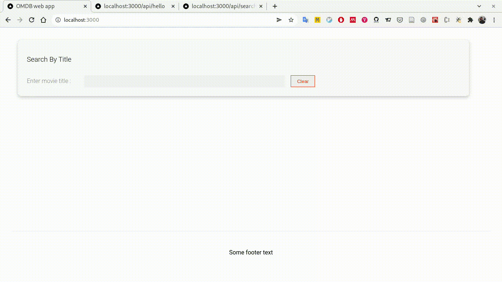

# OMDB-WEB



## Dependencies

Web Frotend is built using production ready [nextjs](https://nextjs.org/) server using **react** library on node version **v15.12.0**

**NOTE:** you would need a OMDB API key to run this project

OMDB API key could be generated [from this link](http://www.omdbapi.com/apikey.aspx)

## Pre-requisites

Once you are ready with the OMDB API key, run following commands to create a secret `.env` file

```
cd omdb-app/web-omdb-app

OMDB_API_KEY="PUT-YOUR-KEY-HERE"
touch .env
echo NEXT_PUBLIC_OMDB_API_KEY=${OMDB_API_KEY} >> .env
```

## How to run the webapp

For development build

```
cd omdb-app/web-omdb-app
yarn install
yarn dev
```

For production build

```
cd omdb-app/web-omdb-app
yarn install
yarn build
yarn start
```

Site would then be accessible at follwing URLs

| url                              | description            |
| -------------------------------- | ---------------------- |
| http://localhost:3000/           | main web interface     |
| http://localhost:3000/api/mock   | mocked OMDB api result |
| http://localhost:3000/api/search | sample search results  |

#### :v: Get in touch with me

> I am looking for Jobs ... :sunglasses:

- [Github](https://github.com/avimehenwal/)
- [My Website](https://avimehenwal.in)
- [My Blog v2](https://avimehenwal2.netlify.app/)
- [Twitter Handle](https://twitter.com/avimehenwal)
- [LinkedIn](https://in.linkedin.com/in/avimehenwal)
- [Stackoverflow](https://stackoverflow.com/users/1915935/avi-mehenwal)

<a href="https://www.buymeacoffee.com/F1j07cV" target="_blank"></a>

Spread Love :hearts: and not :no_entry_sign: hatred [](https://twitter.com/avimehenwal)
